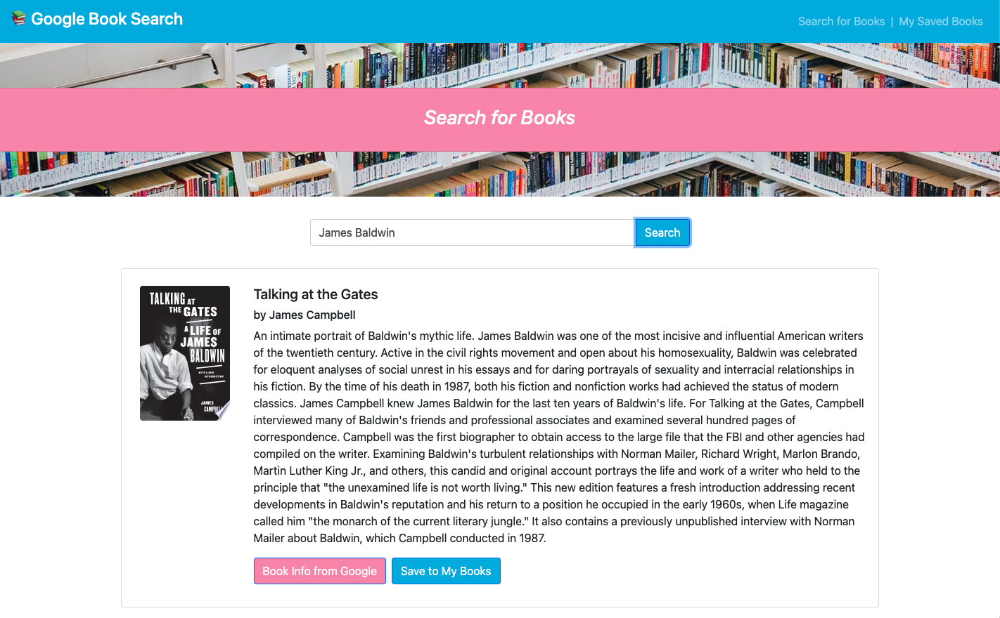

# Google Book Search
Full stack app (MongoDB, Express, React.js, Node) that allows a user to search for books on the Google Books API and save data about book, cover art, and links to more information to their collection. 

## Table of Contents
- [Installation Steps](#installation)
- [Deployed Application](#deployed-application)
- [Screenshots](#screenshots)
- [Licenses](#licenses)

---
## Installation 
To run this app on your machine, use the <code>npm install</code> command in the terminal (optional: use <code>npm run seed</code> to seed the database with data for demonstration purposes), then <code>npm run start</code> to launch the back end server on localhost:3001 and the fron end application on localhost:3000. Then navigate to http://localhost:3000/ in your browser to view the application.

## Deployed Application
[Deployed Application](https://dandandanoneil-google-book-app.herokuapp.com/)

## Screenshots
Search Page Screenshot:

Saved Books Screenshot:

## Licenses
### MIT License

Copyright (c) 2020 Dan O'Neil

Permission is hereby granted, free of charge, to any person obtaining a copy of this software and associated documentation files (the "Software"), to deal in the Software without restriction, including without limitation the rights to use, copy, modify, merge, publish, distribute, sublicense, and/or sell copies of the Software, and to permit persons to whom the Software is furnished to do so, subject to the following conditions:

The above copyright notice and this permission notice shall be included in all copies or substantial portions of the Software.

THE SOFTWARE IS PROVIDED "AS IS", WITHOUT WARRANTY OF ANY KIND, EXPRESS OR IMPLIED, INCLUDING BUT NOT LIMITED TO THE WARRANTIES OF MERCHANTABILITY, FITNESS FOR A PARTICULAR PURPOSE AND NONINFRINGEMENT. IN NO EVENT SHALL THE AUTHORS OR COPYRIGHT HOLDERS BE LIABLE FOR ANY CLAIM, DAMAGES OR OTHER LIABILITY, WHETHER IN AN ACTION OF CONTRACT, TORT OR OTHERWISE, ARISING FROM, OUT OF OR IN CONNECTION WITH THE SOFTWARE OR THE USE OR OTHER DEALINGS IN THE SOFTWARE.

Read more at <https://opensource.org/licenses/MIT>.

---
Generated using [README Generator](https://github.com/dandandanoneil/readme-generator)